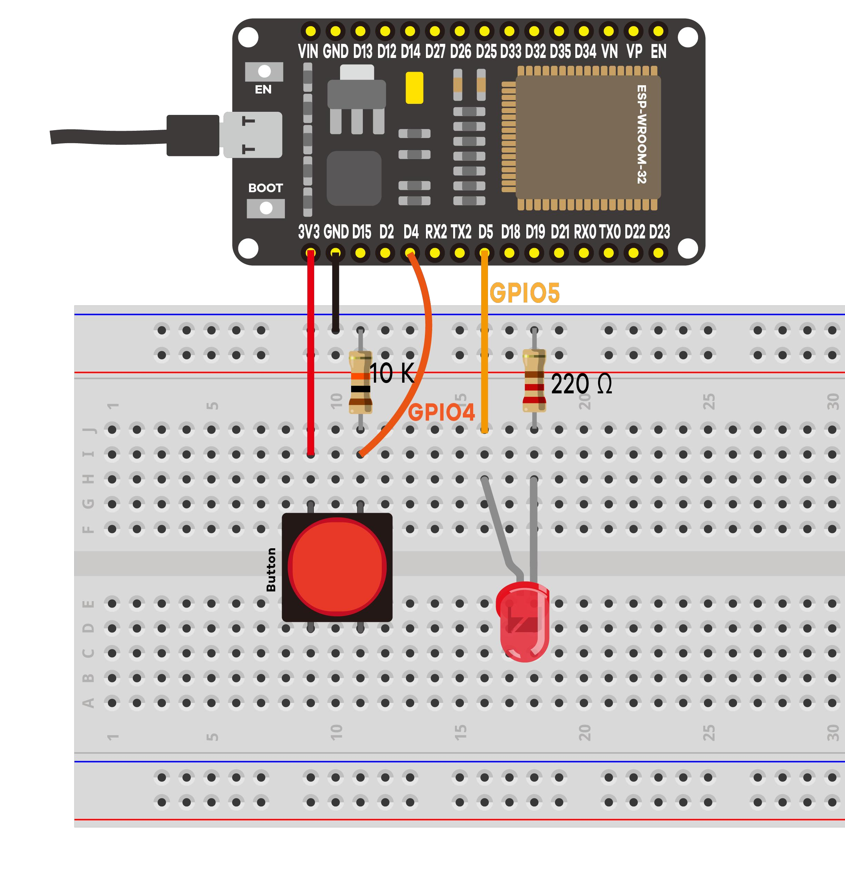
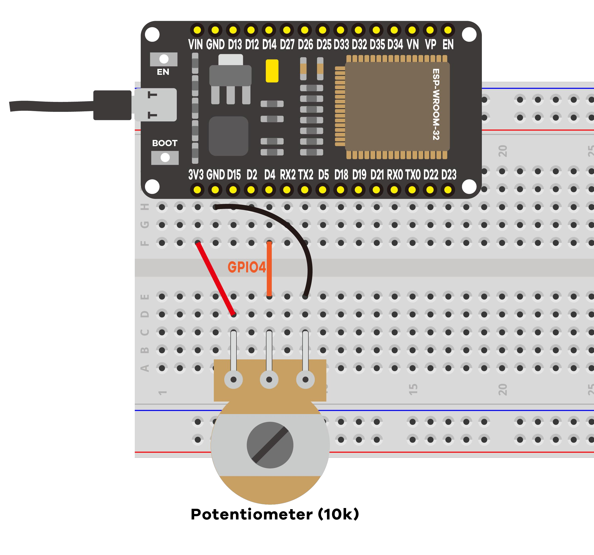
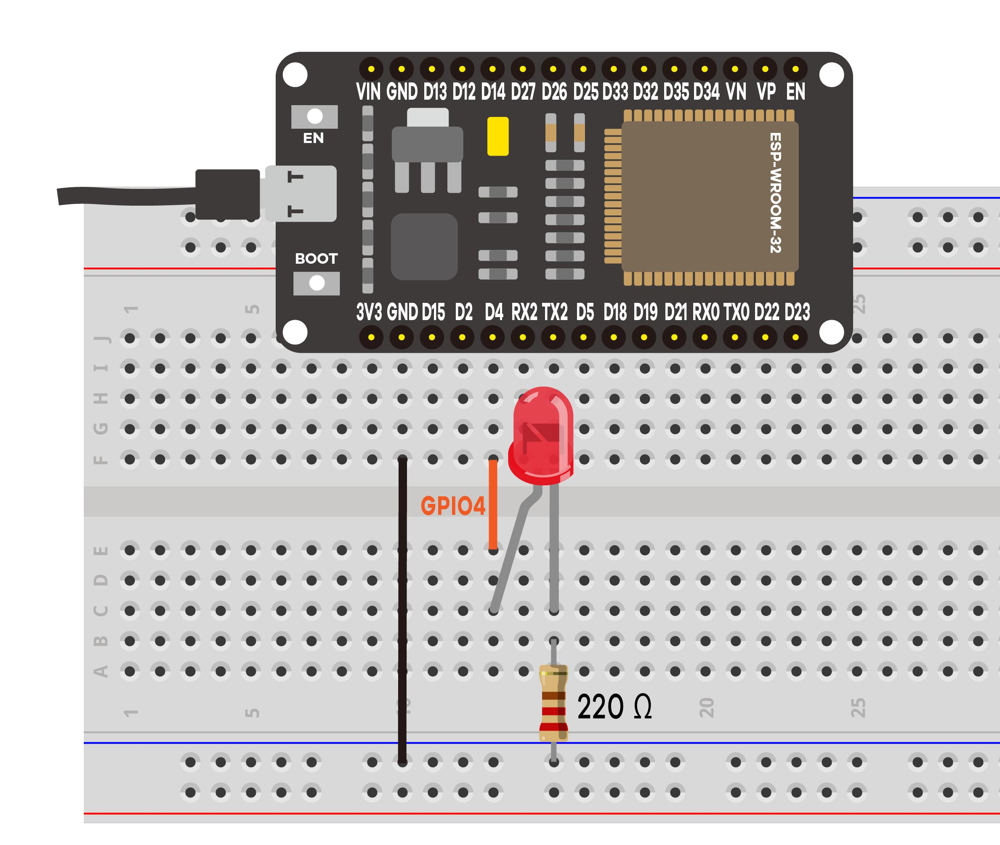
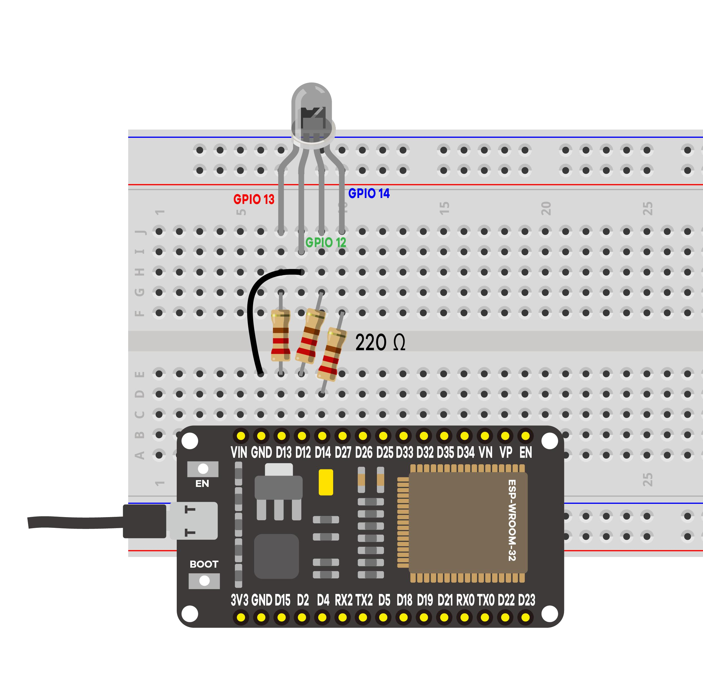
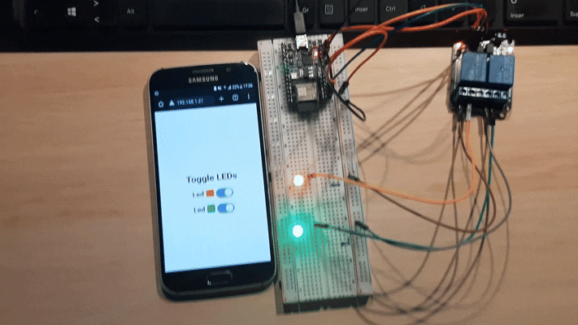
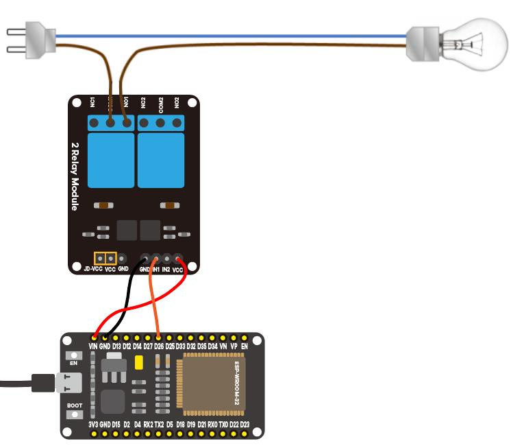

I purchased a basic ESP32 starter kit created by Lafvin with the plan to build each of the 10 projects with Rust instead of Arduino as the documentation calls for. This kit provides an ESP32-WROOM-32 and I also bought an ESP32c3-DevKitm-1 and a Raspberry Pi Pico W to practice on different microcontroller architectures (xtensa, RISC-V and Cortex-M0+ respectively). In this repo I focused on ESPs and I dedicated another repo to the Pico W.

Bare-programming with Arduino is easier than with Rust because of the abstraction layers offers by the sdk but Rust gives us more power to handle the bare-metal with high-level programing style even if it is more verbose.

On ESP32 one can develop as with any other microcontroller by using no_std mode. But thanks to the esp-idf-svc crate (IDF means IoT Development Framework) one can use Rust as usual, that means on std mode. So I used one or the other depending on the type of the project. When it was needed to implement a web server I chose to use the std mode (with esp-idf-svc as framework) instead of implement all from scratch.

For each project, I provide a breadboard schema, a list of components and the arduino code (perhaps I gona upload videos of the finish projects).

<h2 id="heading2">Projects</h2>

Here is the list of projects:

<dl>
<dt>0 - Hello World</dt>  
<dd>The first simple project when one begins in bare-metal programming.</dd>
<dd>I used an ESP32 with no_std.</dd>
</dl>

<dl>
<dt>1 - Blinky</dt>  
<dd>Simple project with a pushbutton and an LED.</dd>
<dd>I used an ESP32 with no_std.</dd>
</dl>

Arduino code

const int buttonPin = 4;
const int ledPin = 5;
int buttonState = 0;

void setup() {
  Serial.begin(115200);
  pinMode(buttonPin, INPUT);
  pinMode(ledPin, OUTPUT);

}

void loop() {
  buttonState = digitalRead(buttonPin);
  Serial.println(buttonState);

  if (buttonState == HIGH) {
    digitalWrite(ledPin, HIGH);
  } else {
    digitalWrite(ledPin, LOW);
  }

}

<dl>
<dt>2 - Analog Inputs (ADC)</dt>  
<dd>Reading an analog voltage value varying between 0V and 3.3V. The voltage measured is then assigned to a value between 0 (0V) and 4095 (3.3V) because the value has 12-bit resolution.</dd>
<dd>I used an ESP32 with no_std.</dd>
</dl>

Arduino code

const int potPin = 4;
int potValue = 0;

void setup() {
  Serial.begin(115200);
  delay(1000);
}

void loop() {
  potValue = analogRead(potPin);
  Serial.println(potValue);
  delay(500);
}

<dl>
<dt>3 - PWM Analog Output</dt>  
<dd>Using the PWM protocol to increase/decrease the LED brightness with a resolution of 12 bits and a frequency of 4 Khz.</dd>
<dd>I used an ESP32 with no_std.</dd>
</dl>

Arduino code

const int ledPin = 4;
const int freq = 5000;
const int ledChannel = 0;
const int resolution = 8;

void setup(){
  ledcSetup(ledChannel, freq, resolution);
  ledcAttachPin(ledPin, ledChannel);
}

void loop(){
  for(int dutyCycle = 0; dutyCycle <= 255; dutyCycle++){
    ledcWrite(ledChannel, dutyCycle);
    delay(15);
  }

  for(int dutyCycle = 255; dutyCycle >= 0; dutyCycle--){
    ledcWrite(ledChannel, dutyCycle);
    delay(15);
  }
}

<dl>
<dt>4 - PIR Motion Sensor</dt>  
<dd>When motion is detected the buzzer will sound an alarm during 500 milliseconds.</dd>
<dd>I used an ESP32 with no_std.</dd>
</dl>

Arduino code

const int buzzerPin =  26;
const int motionSensor = 27;

unsigned long previousMillis = 0;
unsigned long currentMillis;
const long interval = 6000;

void setup() {
   Serial.begin(115200);
  // set the digital pin as output:
  pinMode(buzzerPin, OUTPUT);
  pinMode(motionSensor, INPUT);
}

void loop() 
{
  int reading = digitalRead(motionSensor);
  if (reading == HIGH)
  {digitalWrite(buzzerPin,HIGH);
   Serial.println("Motion detected!Buzzer alarm!");
   previousMillis = millis();
  }
  else{
  currentMillis = millis();
   if (currentMillis - previousMillis >= interval) 
   {
    digitalWrite(buzzerPin, LOW);
    Serial.println("Motion detected!Buzzer stop alarm!");
    }
  }
}

<dl>
<dt>5 - Switch Web Server</dt>  
<dd>Creating a standalone web server that controls (outputs) two Leds. The web server must be mobile responsive and can be accessed with any device that as a browser on the local network.</dd>
<dd>I used an ESP32 in std mode with ESP-IDF.</dd>
</dl>

Arduino code

// Load Wi-Fi library
#include <WiFi.h>

// Replace with your network credentials
const char* ssid = "REPLACE_WITH_YOUR_SSID";
const char* password = "REPLACE_WITH_YOUR_PASSWORD";

// Set web server port number to 80
WiFiServer server(80);

// Variable to store the HTTP request
String header;

// Auxiliar variables to store the current output state
String output26State = "off";
String output27State = "off";

// Assign output variables to GPIO pins
const int output26 = 26;
const int output27 = 27;

// Current time
unsigned long currentTime = millis();
// Previous time
unsigned long previousTime = 0; 
// Define timeout time in milliseconds (example: 2000ms = 2s)
const long timeoutTime = 2000;

void setup() {
  Serial.begin(115200);
  // Initialize the output variables as outputs
  pinMode(output26, OUTPUT);
  pinMode(output27, OUTPUT);
  // Set outputs to LOW
  digitalWrite(output26, LOW);
  digitalWrite(output27, LOW);

  // Connect to Wi-Fi network with SSID and password
  Serial.print("Connecting to ");
  Serial.println(ssid);
  WiFi.begin(ssid, password);
  while (WiFi.status() != WL_CONNECTED) {
    delay(500);
    Serial.print(".");
  }
  // Print local IP address and start web server
  Serial.println("");
  Serial.println("WiFi connected.");
  Serial.println("IP address: ");
  Serial.println(WiFi.localIP());
  server.begin();
}

void loop(){
  WiFiClient client = server.available();   // Listen for incoming clients

  if (client) {                             // If a new client connects,
    currentTime = millis();
    previousTime = currentTime;
    Serial.println("New Client.");          // print a message out in the serial port
    String currentLine = "";                // make a String to hold incoming data from the client
    while (client.connected() && currentTime - previousTime <= timeoutTime) {  // loop while the client's connected
      currentTime = millis();
      if (client.available()) {             // if there's bytes to read from the client,
        char c = client.read();             // read a byte, then
        Serial.write(c);                    // print it out the serial monitor
        header += c;
        if (c == '\n') {                    // if the byte is a newline character
          // if the current line is blank, you got two newline characters in a row.
          // that's the end of the client HTTP request, so send a response:
          if (currentLine.length() == 0) {
            // HTTP headers always start with a response code (e.g. HTTP/1.1 200 OK)
            // and a content-type so the client knows what's coming, then a blank line:
            client.println("HTTP/1.1 200 OK");
            client.println("Content-type:text/html");
            client.println("Connection: close");
            client.println();
            
            // turns the GPIOs on and off
            if (header.indexOf("GET /26/on") >= 0) {
              Serial.println("GPIO 26 on");
              output26State = "on";
              digitalWrite(output26, HIGH);
            } else if (header.indexOf("GET /26/off") >= 0) {
              Serial.println("GPIO 26 off");
              output26State = "off";
              digitalWrite(output26, LOW);
            } else if (header.indexOf("GET /27/on") >= 0) {
              Serial.println("GPIO 27 on");
              output27State = "on";
              digitalWrite(output27, HIGH);
            } else if (header.indexOf("GET /27/off") >= 0) {
              Serial.println("GPIO 27 off");
              output27State = "off";
              digitalWrite(output27, LOW);
            }
            
            // Display the HTML web page
            client.println("<!DOCTYPE html><html>");
            client.println("<head><meta name=\"viewport\" content=\"width=device-width, initial-scale=1\">");
            client.println("<link rel=\"icon\" href=\"data:,\">");
            // CSS to style the on/off buttons 
            // Feel free to change the background-color and font-size attributes to fit your preferences
            client.println("</head>");
            
            // Web Page Heading
            client.println("<body><h1>ESP32 Web Server</h1>");
            
            // Display current state, and ON/OFF buttons for GPIO 26  
            client.println("
GPIO 26 - State " + output26State + "
");
            // If the output26State is off, it displays the ON button       
            if (output26State=="off") {
              client.println("
<a href=\"/26/on\"><button class=\"button\">ON</button></a>
");
            } else {
              client.println("
<a href=\"/26/off\"><button class=\"button button2\">OFF</button></a>
");
            } 
               
            // Display current state, and ON/OFF buttons for GPIO 27  
            client.println("
GPIO 27 - State " + output27State + "
");
            // If the output27State is off, it displays the ON button       
            if (output27State=="off") {
              client.println("
<a href=\"/27/on\"><button class=\"button\">ON</button></a>
");
            } else {
              client.println("
<a href=\"/27/off\"><button class=\"button button2\">OFF</button></a>
");
            }
            client.println("</body></html>");
            
            // The HTTP response ends with another blank line
            client.println();
            // Break out of the while loop
            break;
          } else { // if you got a newline, then clear currentLine
            currentLine = "";
          }
        } else if (c != '\r') {  // if you got anything else but a carriage return character,
          currentLine += c;      // add it to the end of the currentLine
        }
      }
    }
    // Clear the header variable
    header = "";
    // Close the connection
    client.stop();
    Serial.println("Client disconnected.");
    Serial.println("");
  }
}

<dl>
<dt>6 - RGB LED Web Server</dt>  
<dd>Creating a web sever to change the color of a RGB LED. The web server must be mobile responsive and can be accessed with any device that as a browser on the local network.</dd>
<dd>I used an ESP32c3 in std mode with ESP-IDF.</dd>
</dl>

Arduino code

// Load Wi-Fi library
#include <WiFi.h>

// Replace with your network credentials
const char* ssid = "REPLACE_WITH_YOUR_SSID";
const char* password = "REPLACE_WITH_YOUR_PASSWORD";
// Set web server port number to 80
WiFiServer server(80);

// Decode HTTP GET value
String redString = "0";
String greenString = "0";
String blueString = "0";
int pos1 = 0;
int pos2 = 0;
int pos3 = 0;
int pos4 = 0;

// Variable to store the HTTP req  uest
String header;

// Red, green, and blue pins for PWM control
const int redPin = 13;     // 13 corresponds to GPIO13
const int greenPin = 12;   // 12 corresponds to GPIO12
const int bluePin = 14;    // 14 corresponds to GPIO14

// Setting PWM frequency, channels and bit resolution
const int freq = 5000;
const int redChannel = 0;
const int greenChannel = 1;
const int blueChannel = 2;
// Bit resolution 2^8 = 256
const int resolution = 8;

// Current time
unsigned long currentTime = millis();
// Previous time
unsigned long previousTime = 0; 
// Define timeout time in milliseconds (example: 2000ms = 2s)
const long timeoutTime = 2000;

void setup() {
  Serial.begin(115200);
  // configure LED PWM functionalitites
  ledcSetup(redChannel, freq, resolution);
  ledcSetup(greenChannel, freq, resolution);
  ledcSetup(blueChannel, freq, resolution);
  
  // attach the channel to the GPIO to be controlled
  ledcAttachPin(redPin, redChannel);
  ledcAttachPin(greenPin, greenChannel);
  ledcAttachPin(bluePin, blueChannel);
  
  // Connect to Wi-Fi network with SSID and password
  Serial.print("Connecting to ");
  Serial.println(ssid);
  WiFi.begin(ssid, password);
  while (WiFi.status() != WL_CONNECTED) {
    delay(500);
    Serial.print(".");
  }
  // Print local IP address and start web server
  Serial.println("");
  Serial.println("WiFi connected.");
  Serial.println("IP address: ");
  Serial.println(WiFi.localIP());
  server.begin();
}

void loop(){
  WiFiClient client = server.available();   // Listen for incoming clients

  if (client) {                             // If a new client connects,
    currentTime = millis();
    previousTime = currentTime;
    Serial.println("New Client.");          // print a message out in the serial port
    String currentLine = "";                // make a String to hold incoming data from the client
    while (client.connected() && currentTime - previousTime <= timeoutTime) {            // loop while the client's connected
      currentTime = millis();
      if (client.available()) {             // if there's bytes to read from the client,
        char c = client.read();             // read a byte, then
        Serial.write(c);                    // print it out the serial monitor
        header += c;
        if (c == '\n') {                    // if the byte is a newline character
          // if the current line is blank, you got two newline characters in a row.
          // that's the end of the client HTTP request, so send a response:
          if (currentLine.length() == 0) {
            // HTTP headers always start with a response code (e.g. HTTP/1.1 200 OK)
            // and a content-type so the client knows what's coming, then a blank line:
            client.println("HTTP/1.1 200 OK");
            client.println("Content-type:text/html");
            client.println("Connection: close");
            client.println();
                   
            // Display the HTML web page
            client.println("<!DOCTYPE html><html>");
            client.println("<head><meta name=\"viewport\" content=\"width=device-width, initial-scale=1\">");
            client.println("<link rel=\"icon\" href=\"data:,\">");
            client.println("<link rel=\"stylesheet\" href=\"https://stackpath.bootstrapcdn.com/bootstrap/4.3.1/css/bootstrap.min.css\">");
            client.println("");
            client.println("</head><body>

<h1>ESP Color Picker</h1>
");
            client.println("<a class=\"btn btn-primary btn-lg\" href=\"#\" id=\"change_color\" role=\"button\">Change Color</a> ");
            client.println("<input class=\"jscolor {onFineChange:'update(this)'}\" id=\"rgb\">
");
            client.println("</body></html>");
            // The HTTP response ends with another blank line
            client.println();

            // Request sample: /?r201g32b255&
            // Red = 201 | Green = 32 | Blue = 255
            if(header.indexOf("GET /?r") >= 0) {
              pos1 = header.indexOf('r');
              pos2 = header.indexOf('g');
              pos3 = header.indexOf('b');
              pos4 = header.indexOf('&');
              redString = header.substring(pos1+1, pos2);
              greenString = header.substring(pos2+1, pos3);
              blueString = header.substring(pos3+1, pos4);
              /*Serial.println(redString.toInt());
              Serial.println(greenString.toInt());
              Serial.println(blueString.toInt());*/
              ledcWrite(redChannel, redString.toInt());
              ledcWrite(greenChannel, greenString.toInt());
              ledcWrite(blueChannel, blueString.toInt());
            }
            // Break out of the while loop
            break;
          } else { // if you got a newline, then clear currentLine
            currentLine = "";
          }
        } else if (c != '\r') {  // if you got anything else but a carriage return character,
          currentLine += c;      // add it to the end of the currentLine
        }
      }
    }
    // Clear the header variable
    header = "";
    // Close the connection
    client.stop();
    Serial.println("Client disconnected.");
    Serial.println("");
  }

<dl>
<dt>7 - Relay Web Server</dt>  
<dd>Creating a web server to control electrical appliances remotely thanks to a relay. Abviously, the web server must be responsive and accessible from any device.</dd>
<dd>I used an ESP32c3 in std mode with ESP-IDF.</dd>
</dl>

Arduino code

<dl>
<dt>8 - Output State Synchronization Web Server</dt>  
<dd>Controlling ESP outputs by using a web server and/or a physical button. The output state is updated on the web page wether it is changed via physical button or web server.</dd>
<dd>I used an ESP32c3 in no_std and async way with Embassy.</dd>
</dl>

<dl>
<dt>9 - DHT11 Web Server</dt>  
<dd></dd>
<dd></dd>
</dl>

<dl>
<dt>10 - OLED Display</dt>  
<dd></dd>
<dd></dd>
</dl>

<a href="https://github.com/m1kc3b/rust-on-esp32/tree/main/project_0" target="_blank">GitHub repo</a>

